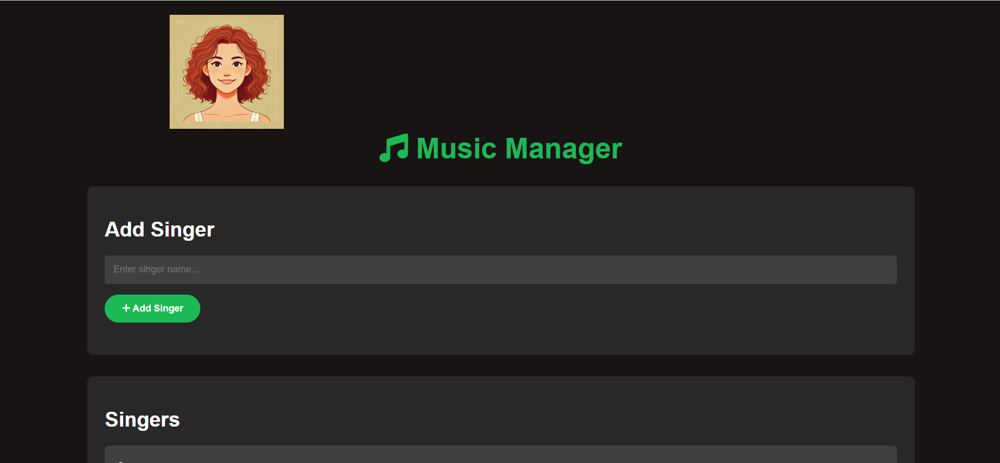

# Music Manager Application

This project is a simple **Music Manager application** that allows users to manage singers and songs. It uses **Flask** as the web framework and **MongoDB** as the database. Users can add and remove singers and songs, and associate singers with songs.


## Demo



## Features
- Add and remove singers.
- Add and remove songs.
- Associate songs with one or more singers.

---

## Prerequisites
Before running the project, make sure you have the following tools installed:
- **Docker** and **Docker Compose** (for local development and deployment)
- **Kubernetes** (for deployment in a Kubernetes cluster)
- **MongoDB** (for the database)

---

## Running the App with Docker Compose

### Clone the repository:
```bash
git clone <repository-url>
cd <repository-directory>
```

### Set up your environment variables:
The application uses environment variables to connect to the MongoDB database. Create a .env file in the root directory of the project with the following content:

```env
MONGO_USERNAME=admin
MONGO_PASSWORD=password123
MONGO_HOST=db
MONGO_PORT=27017
```

### Run the application with Docker Compose:
Docker Compose will set up both the web app and the MongoDB database services for you.

```bash
docker-compose up --build
```
This will build and start both services. The Flask application will be available at http://localhost:5000, and the MongoDB database will be running on the db container.

### Access the application:
Open your browser and navigate to http://localhost:5000. You should see the Music Manager interface where you can add and remove singers and songs.

### Stopping the services:
To stop the services, run:

```bash
docker-compose down
```

# Running the App in Kubernetes (K8s)

## Prerequisites
- **Kubernetes Cluster**: Ensure you have a running Kubernetes cluster. For a local setup, tools like **Minikube** or **Docker Desktop** can create a local cluster.
- **Kubectl**: Ensure `kubectl` is installed and configured to access your Kubernetes cluster.
- **MongoDB Deployment**: This app requires a MongoDB instance running in Kubernetes.

---

## Steps

### Clone the repository:
```bash
git clone <repository-url>
cd <repository-directory>
```
### Create the Secrets for MongoDB credentials:
To securely store MongoDB credentials, create a Kubernetes Secret:

```bash
kubectl create secret generic mongo-credentials \
--from-literal=MONGO_USERNAME=[desired user name] \
--from-literal=MONGO_PASSWORD=[desired password]
```

### Deploy MongoDB and the Web Application:
Deploy MongoDB using the provided db-deployment.yaml and db-service.yaml. This will create a MongoDB pod and service within your Kubernetes cluster.

```bash
kubectl apply -f db-deployment.yaml
kubectl apply -f db-service.yaml
```

Deploy the Web Application:
Deploy the web application using the provided web-deployment.yaml and web-service.yaml:

``` bash
kubectl apply -f web-deployment.yaml
kubectl apply -f web-service.yaml
```
The web application will connect to the MongoDB service using the credentials stored in the secret.

### Access the Application:
To access the web application, use kubectl port-forward to forward the service's port to your local machine:

``` bash
kubectl port-forward svc/web 5000:5000
```
Now, open your browser and go to http://localhost:5000.

### Stopping the services:
To stop the Kubernetes deployment, delete the pods and services:

```bash
kubectl delete -f web-deployment.yaml
kubectl delete -f web-service.yaml
kubectl delete -f db-deployment.yaml
kubectl delete -f db-service.yaml
```


# License
This project is licensed under the MIT License – see the LICENSE file for details.

# Conclusion
This project is a simple Flask app that integrates with MongoDB to manage a collection of singers and songs. Whether you choose to run it on Kubernetes or with Docker Compose, it provides a flexible and easy way to deploy the app.


